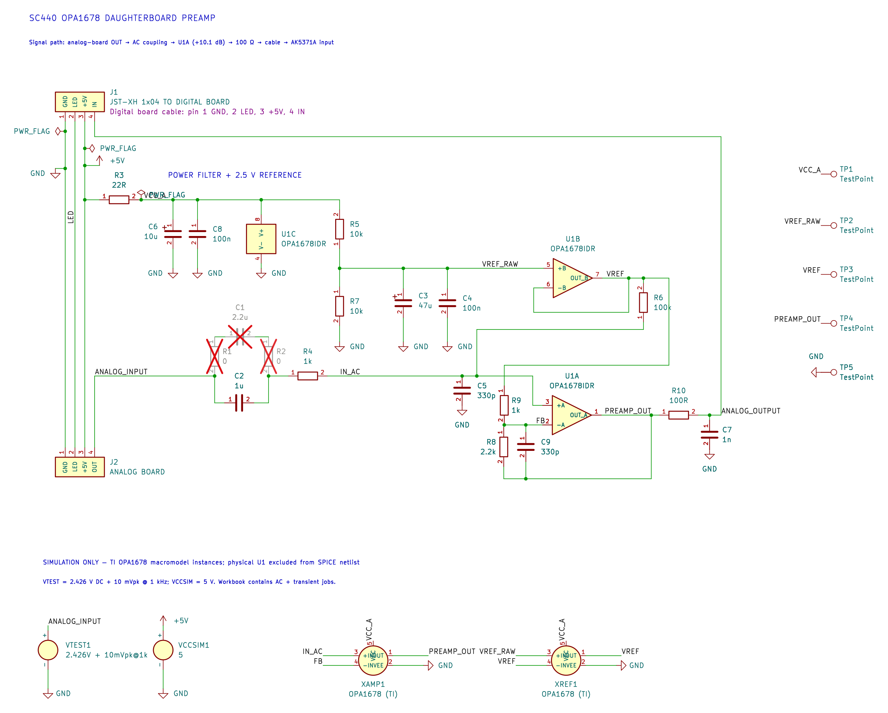
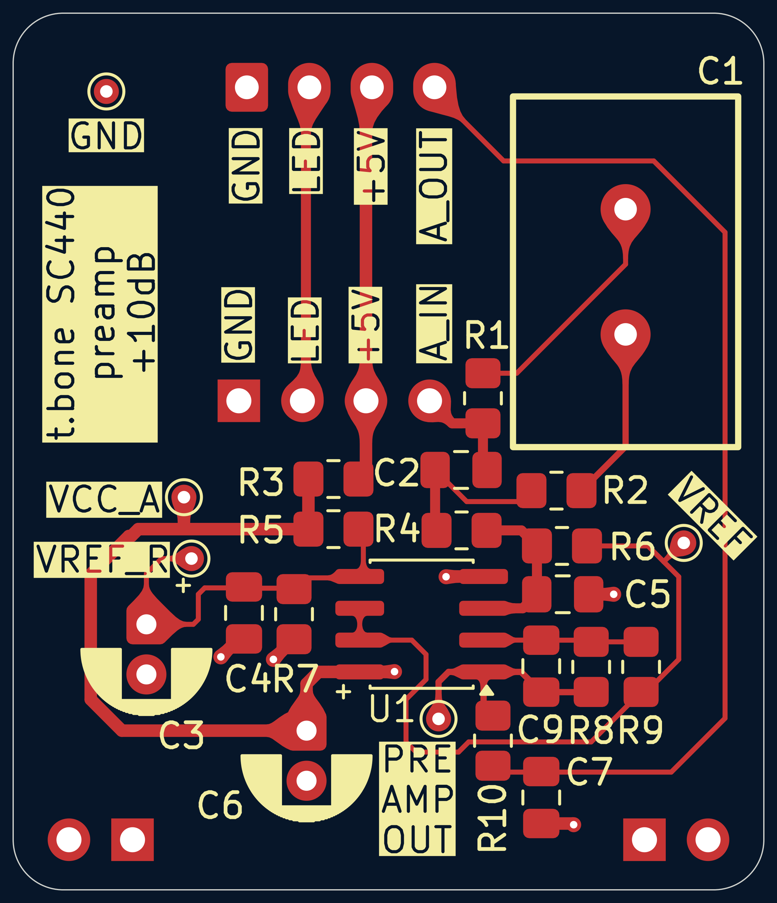
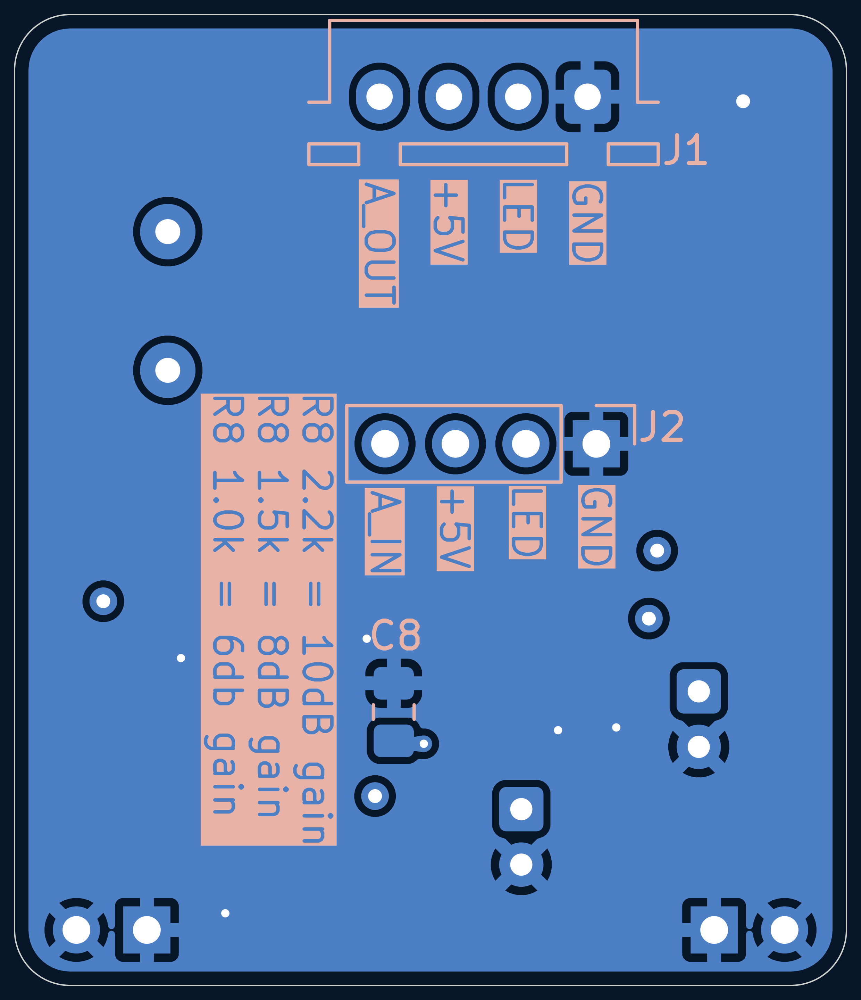
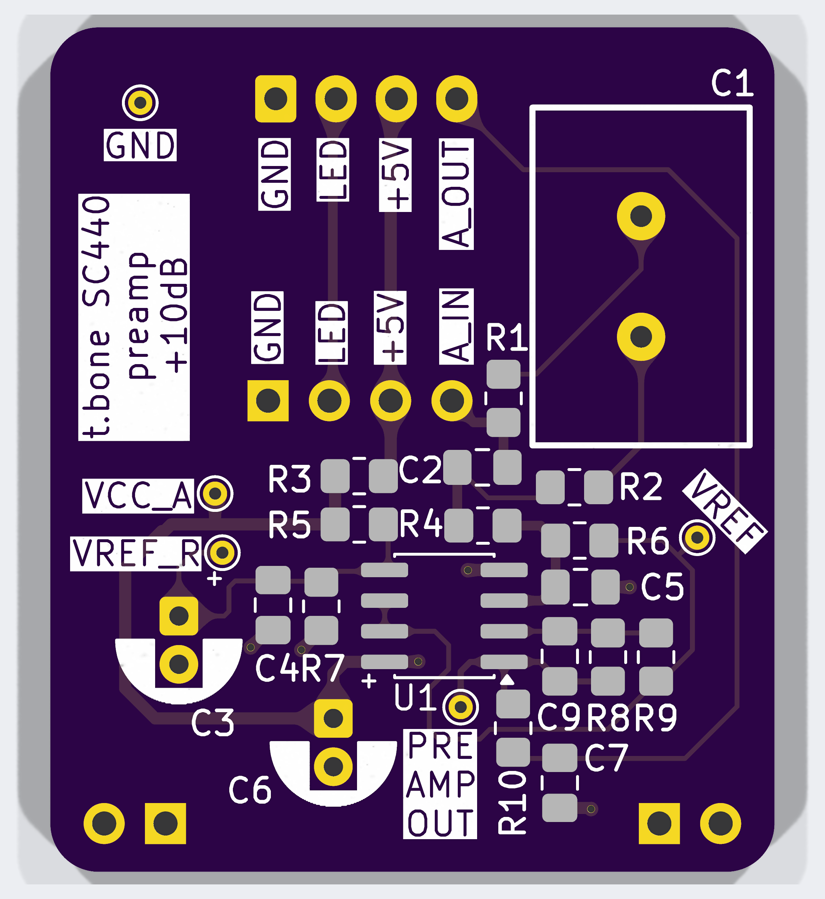
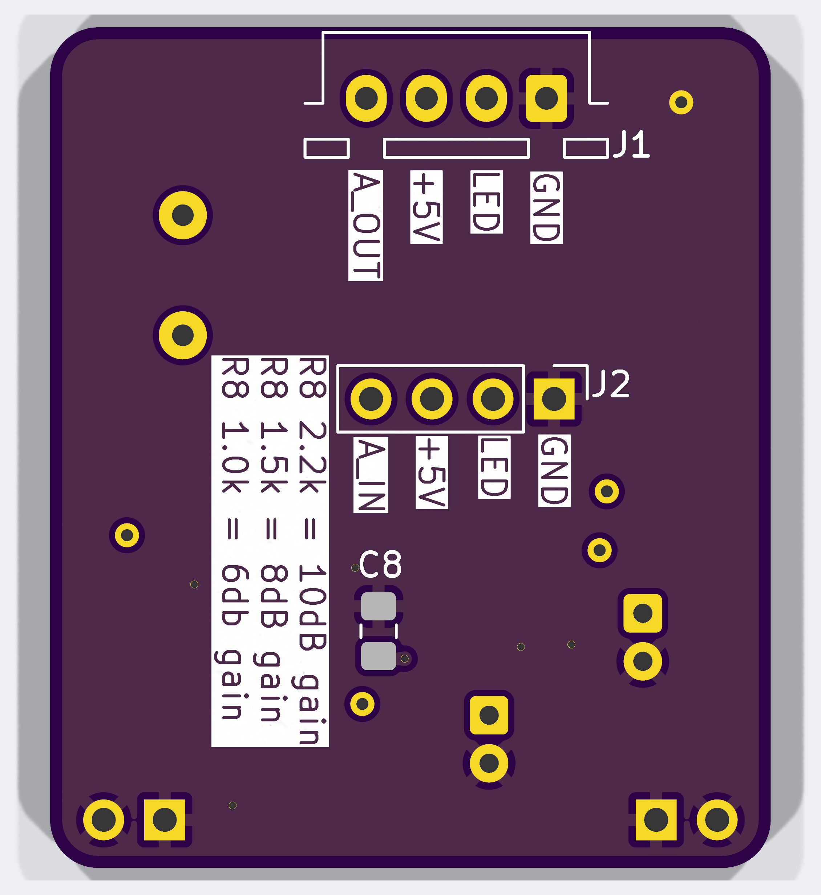

# SC440 OPA1678 microphone preamp

## don't try this at home

Caveat: measurements show that the theoretical use for this preamp is a
reduction of the noise floor by a whopping 0.2dB. The noise seems to come from
either the capsule or the analog board.

So this is a nice flex mod as an exercise in analogue circuitry, but don't
expect any quality gains from it at all.

## Intro


A 5 V analog gain board for the **t.bone SC 440 USB microphone**. It sits between
its original microphone/JFET board and USB/ADC board, AC-couples the signal,
rebiases it around a buffered half-supply reference, and adds selectable gain.
The aim is to use less gain in the following ADC stage. A reduction in overall
recording noise depends on how much noise that stage contributes; microphone
and original analog-board noise are amplified along with the signal.

**Default in the current KiCad files:** amplifier gain +10.10 dB, using R8 = 2.2 kΩ and
R9 = 1 kΩ, with the C2 = 1 µF MLCC input option. C1, R1 and R2 are DNP.
C9 = 330 pF is populated across R8.

The board outline is **30 × 35 mm**, with 2 mm corner radii. PCB thickness in
this project is **1.6 mm**. Files were saved with **KiCad 10.99 nightly**; use a
build that supports their file format.

- [Assembly choices: gain and input capacitor](#assembly-choices)
- [Bill of materials](#bill-of-materials)
- [Connections and installation](#connections-and-installation)
- [Circuit and test points](#circuit-and-test-points)
- [Views](#views)
- [Simulation](#simulation)
- [Regenerating the README images](#regenerating-the-readme-images)

## Assembly choices

### Gain: approximately 6, 8 or 10 dB

The non-inverting amplifier uses `Av = 1 + R8/R9`, with R9 fixed at **1 kΩ**.
Populate one R8 value; these are alternatives, not additional resistors.

| Variant | R8 | R9 | Voltage gain | Gain | Concrete R8 example, Yageo thin film |
|---|---:|---:|---:|---:|---|
| 6 dB | 1 kΩ | 1 kΩ | 2.0× | +6.02 dB | `RT0805BRD071KL` |
| 8 dB | 1.5 kΩ | 1 kΩ | 2.5× | +7.96 dB | `RT0805BRD071K5L` |
| **10 dB — CAD default** | **2.2 kΩ** | **1 kΩ** | **3.2×** | **+10.10 dB** | `RT0805BRD072K2L` |

The table gives the amplifier gain. End-to-end gain from J2 pin 4 to J1 pin 4
is slightly lower: R4/R6 alone introduce about 0.086 dB attenuation. The
unloaded AC model gives approximately **5.93 / 7.87 / 10.01 dB at 1 kHz**
for the default MLCC option. See [SIMULATION_VALIDATION.md](SIMULATION_VALIDATION.md)
for both capacitor options and the 20 kHz results.

These parts are 0805, 0.1%, 25 ppm/°C, 0.125 W. Ordinary 1% resistors also work;
thin film is preferred for R8/R9 for ratio stability and low excess noise.
Thin film does not eliminate thermal noise. The lower resistance values reduce
that contribution compared with the older 22 kΩ/10 kΩ pair.

Use 6 dB where input-level headroom matters most; 10 dB provides the greatest
analog boost. For a fixed ADC clipping level, allowable microphone-board input
amplitude is inversely proportional to the selected voltage gain. Reduce ADC
gain to obtain comparable recording levels, then check loud speech and plosives.
An analog booster does not increase the ADC's full-scale voltage.

**C9 remains 330 pF for all three variants.** Its feedback-network pole is
approximately 482 kHz / 322 kHz / 219 kHz for 6 / 8 / 10 dB respectively. This
reduces the ideal amplifier gain toward unity at high frequencies; it is not a
filter whose gain falls to zero. Its calculated contribution at 20 kHz is only
about −0.006 / −0.014 / −0.032 dB respectively, before other circuit roll-off.

### Input coupling: MLCC or film

Choose exactly one of the following assemblies. The input resistor R4 and bias
resistor R6 are unchanged for either option.

| Part | **A — compact MLCC, CAD default** | **B — film** |
|---|---|---|
| C2 | **1 µF, 0805, X7R**, ≥16 V | **DNP** |
| C1 | DNP | **2.2 µF PET film**, Faratronic `C241J225J2SC000`, 63 V, 5 mm pitch |
| R1, R2 | DNP | **0 Ω each**, 0805 |
| R4 | 1 kΩ | 1 kΩ |
| R6 | 100 kΩ | 100 kΩ |
| Approximate input high-pass pole | 1.6 Hz | 0.72 Hz |

The default path is C2 → R4 → IN_AC. The film path is
R1 → C1 → R2 → R4 → IN_AC. Do not populate both coupling branches: the two
capacitors would operate in parallel rather than select a single option.

Both coupling capacitors are non-polarized. Film avoids the ferroelectric
voltage dependence and microphony of X7R, but takes more space. The MLCC option
is the compact assembly; its effective capacitance depends on the exact part
and bias. These differences do not by themselves establish an audible benefit
in the complete microphone.

The film variant requires assembly changes only. If editing KiCad to represent
that variant, mark C2 DNP and clear DNP on C1/R1/R2, then update the PCB from the
schematic. C1/R1/R2 are currently excluded from simulation as well, so changing
DNP flags alone is not sufficient to simulate the film path.

## Bill of materials

Quantities below are **per preamp PCB**. They describe the current electrical
values and footprints. Orderable examples are documented choices, not proof
that those exact manufacturers are already installed. Equivalent parts must
match value, dielectric/technology, package and mechanical clearance.

All SMD passives use **0805 hand-solder footprints**. Resistor examples are
0.125 W. No special “audio-grade” electrolytics are needed. Prices and stock
are intentionally not fixed in this BOM.

### Common parts for all six gain/capacitor combinations

| Ref. | Qty | Value / specification | Package / assembly side | Concrete part or ordering specification |
|---|---:|---|---|---|
| U1 | 1 | OPA1678 dual audio op-amp | SOIC-8, 3.9 × 4.9 mm, 1.27 mm pitch; front | **Texas Instruments `OPA1678IDR`**; do not substitute VSSOP/SON versions |
| R3 | 1 | 22 Ω, 1% | 0805; front | Yageo `RC0805FR-0722RL` |
| R4, R9 | 2 | 1 kΩ; thin film, 0.1% recommended | 0805; front | Yageo **`RT0805BRD071KL`**; thin film at R4 is optional |
| R5, R7 | 2 | 10 kΩ, 1% | 0805; front | Yageo `RC0805FR-0710KL` |
| R6 | 1 | 100 kΩ, 1% | 0805; front | Yageo `RC0805FR-07100KL` |
| R8 | 1 | **Select 1 kΩ / 1.5 kΩ / 2.2 kΩ** | 0805; front | Select exactly one part from the gain table above |
| R10 | 1 | 100 Ω, 1% | 0805; front | Yageo `RC0805FR-07100RL` |
| C3 | 1 | 47 µF, 16 V, ±20%, polarized | Radial, Ø5 × 11 mm, 2 mm pitch; front | **Aishi `ERS1CM470D11OT`**, [LCSC C160836](https://www.lcsc.com/product-detail/C160836.html), matching the schematic link |
| C4, C8 | 2 | 100 nF, X7R, ±10%, ≥16 V | 0805; **C4 front, C8 back** | Example: Murata `GRM21BR71H104KA01L`, 50 V |
| C5, C9 | 2 | 330 pF, **C0G/NP0**, ±5% | 0805; front | Example: Murata **`GRM2165C2A331JA01D`**, 100 V |
| C6 | 1 | 10 µF, 16 V, ±20%, polarized | Radial, Ø5 × 11 mm, 2 mm pitch; front, **mount lying down** | **Chengx `KM106M016D11RR0VH2FP0`**, [LCSC C43799](https://www.lcsc.com/product-detail/C43799.html), matching the schematic link |
| C7 | 1 | 1 nF, **C0G/NP0**, ±5% | 0805; front | Example: Murata **`GRM2165C2A102JA01D`**, 100 V |
| J1 | 1 | 4-pin JST XH header to digital board | **2.50 mm**, vertical/top-entry; back | **JST `B4B-XH-A`**; RoHS/tinning suffix may be shown as `(LF)(SN)` |
| J2 | 1 | 4-pin male header to analog board | **2.54 mm**, straight; back | 1×4, 0.64 mm square pins; cut from a standard strip; choose mating length to suit original socket and board spacing |
| TP1–TP5 | 5 PCB pads | Test pads, no purchased component required | 1 × 1 mm THT pad, 0.5 mm drill; front | Optional fine wire for probing; not five additional headers |

**C4 and C8 are required bypass capacitors and are included in the BOM.** Their
previous exclusion flags have been cleared in the root schematic, PCB and
synchronized AC schematic.

C3 alternative: **Rubycon `35ZLH47MEFC5X11`**, 47 µF / 35 V, Ø5 × 11 mm,
2 mm pitch, [LCSC C109390](https://www.lcsc.com/product-detail/C109390.html).
It fits the nominal pad pitch/body diameter and is electrically suitable;
ZLH is a low-impedance series, not a dedicated low-leakage series. The higher
voltage rating is not necessary here. Low leakage is useful at VREF_RAW, but a
standard good-quality aluminum electrolytic is sufficient for this application.

### Add parts for exactly one input option

| Variant | Ref. | Qty | Specification | Concrete example |
|---|---|---:|---|---|
| **A — MLCC** | C2 | 1 | 1 µF, X7R, ±10%, 0805, ≥16 V | Murata **`GRM219R71E105KA88D`**, 25 V |
| **B — film** | C1 | 1 | 2.2 µF, PET, ±5%, 63 V, 5 mm lead pitch | Faratronic **`C241J225J2SC000`**, [LCSC C5372007](https://www.lcsc.com/product-detail/C5372007.html) |
| **B — film** | R1, R2 | 2 | 0 Ω links, 0805 | Yageo **`RC0805JR-070RL`**, or suitable solder bridges |

The MLCC assembly has **14 SMD passives and two radial electrolytics**. The film
assembly has **15 SMD passives, two radial electrolytics and one film capacitor**.
Both also use U1, J1 and J2. Simulation sources and XREF1/XAMP1 are not physical
parts to order.

### Cable, original-board modification and mechanical supports

| Item | Qty per complete installation | Concrete choice / notes |
|---|---:|---|
| Additional digital-board header | 1 | JST **`B4B-XH-A`**, if replacing the original digital-board socket as described below; verify its hole spacing separately |
| Cable housings | 2 | JST **`XHP-4`**, 4 positions |
| Crimp contacts | 8 | JST **`SXH-001T-P0.6`**, for 22–28 AWG wire; use the matching crimp tooling, or a correctly wired premade XH cable |
| Cable conductors | 4 | Short flexible wires; verify pin-to-pin continuity rather than trusting wire colors |
| Replacement analog-board header | As required | Standard 2.54 mm 1×4 header; original connector relocation is part of the installation, not an extra gain-stage component |
| PCB-only support footprints | 2, optional mechanical population | Two back-side **1×2, 2.54 mm pin sockets**, currently both called `REF**`; their pads have **no electrical nets**. Select height to suit the original board or leave unpopulated if not needed for support |

Part references: [TI OPA1678 datasheet](https://www.ti.com/lit/ds/symlink/opa1678.pdf),
[JST XH datasheet](https://www.jst-mfg.com/product/pdf/eng/eXH.pdf),
[Yageo 2.2 kΩ RT specification](https://www.yageogroup.com/component-documentation/download/specsheet/RT0805BRD072K2L),
[Yageo 1.5 kΩ RT specification](https://www.yageogroup.com/component-documentation/download/specsheet/RT0805BRD071K5L),
[Yageo 1 kΩ RT specification](https://www.yageogroup.com/component-documentation/download/specsheet/RT0805BRD071KL),
[Murata MLCC catalog, including C0G parts](https://www.mouser.com/datasheet/2/281/murata_mure-s-a0000034126-1-1740300.pdf),
and [Murata 100 nF specification](https://search.murata.co.jp/Ceramy/image/img/A01X/G101/ENG/GRM21BR71H104KA01-01.pdf).
See [FOOTPRINT_CHECK.md](FOOTPRINT_CHECK.md) for the actual symbol/pad/device cross-check.

## Connections and installation

### Connector pinout

**J1 is the digital-board connector; J2 is the analog-board connector.** Both
are installed on the **back** of this PCB. The two pitches differ: JST XH is
2.50 mm, the unshrouded analog header is 2.54 mm.

| Pin number | J2 — from analog board | J1 — to digital board | Connection on this PCB |
|---|---|---|---|
| 1 | GND | GND | Direct common ground |
| 2 | LED | LED | Direct pass-through |
| 3 | +5V | +5V | Direct pass-through; preamp supply branches through R3 |
| 4 | ANALOG_INPUT | ANALOG_OUTPUT | Through coupling capacitor, amplifier and R10; **not** direct |

Use pad numbers, including the square pin-1 pad, rather than assuming a
left-to-right order from a photograph. Back-side placement and mirrored views
change the apparent order. Check the cable at both ends before connecting USB.

The intended installation mounts the daughterboard behind the original analog
PCB. Remove/reposition the original analog-board pin headers to the opposite
side to make the required board-to-board connection. Replace the original
digital-board pin socket with a JST XH header and use a short 4-wire cable to
J1. Verify actual original-board holes, mating parts and enclosure clearance
before final soldering; the daughterboard files do not define those original
board footprints.

**Keep the existing series DC-blocking capacitor on the digital-board audio
input.** J1 pin 4 carries the amplified AC signal on a DC level near VREF. There
is no output coupling capacitor on the daughterboard itself. The microphone's
exact ADC-side connection must be checked on the physical digital board.

C6 needs to be mounted **lying down** in the intended enclosure. Its CAD model
is a generic upright radial capacitor, so the 3D view is not the final assembly
orientation. Preserve polarity, avoid stressing the lead seals, and keep the
body/metalwork clear of exposed conductors. Check C3 and the optional C1 against
available height too. C1 currently has no attached 3D model.

## Circuit and test points

| Block | Actual parts / connections | Purpose / approximate behavior |
|---|---|---|
| Supply filter | R3 = 22 Ω; C6 = 10 µF and C8 = 100 nF from VCC_A to GND | Filters raw USB 5 V; ideal R3/C6 pole ≈723 Hz |
| Reference divider | R5 = 10 kΩ from VCC_A to VREF_RAW; R7 = 10 kΩ to GND; C3 = 47 µF and C4 = 100 nF to GND | Approximately VCC_A/2; divider/C3 pole ≈0.68 Hz |
| Reference buffer | U1B: pin 5 at VREF_RAW, pins 6/7 at VREF | Low-impedance reference for input bias and feedback |
| Input coupling / bias | C2 or C1/R1/R2; R4 = 1 kΩ; R6 = 100 kΩ to VREF | Blocks original-board DC and establishes the amplifier bias |
| Input RF filter | R4 with C5 = 330 pF from IN_AC to GND | Pole approximately 0.48 MHz for a low-impedance source; source impedance also matters |
| Amplifier | U1A; R8 from PREAMP_OUT to FB, R9 from FB to VREF | Gain selected by R8/R9 |
| Feedback HF shaping | C9 = 330 pF parallel to R8 | Gradually reduces gain toward unity above the feedback pole |
| Output isolation / filter | R10 = 100 Ω; C7 = 1 nF from ANALOG_OUTPUT to GND | Isolates capacitive cable/input load; ideal RC pole ≈1.59 MHz |

These pole calculations describe individual networks, not the complete loaded
frequency response. Cable/ADC loading and the op-amp's finite bandwidth also
contribute. Do not add a large capacitor directly to the buffered VREF output
without checking the buffer's capacitive-load stability; C3/C4 are on VREF_RAW.

| Test pad | Net | Expected DC with USB connected, no audio |
|---|---|---|
| TP1 | VCC_A | Raw +5V minus the drop across R3; **at least 4.5 V** for OPA1678 operation |
| TP2 | VREF_RAW | Approximately TP1/2 |
| TP3 | VREF | Approximately TP2 |
| TP4 | PREAMP_OUT | Approximately TP3 |
| TP5 | GND | Probe reference |

Raw USB voltage was reported above 4.9 V. At roughly 4.2 mA quiescent draw the
22 Ω resistor drops about 0.09 V; this is an estimate, not a minimum-voltage
measurement at the IC. Check TP1 under operation. The input signal is centered
near half supply; OPA1678 is not rail-to-rail at its inputs.

For commissioning, first check power and reference voltages, then compare
recordings at equal final level with reduced ADC gain. Check clipping with loud
speech/plosives and look for USB-related spurs. A valid rendering or simulated
trace does not replace those measurements.

## Views

The included images represent the saved default assembly (10 dB, MLCC).

### Schematic



### PCB layout — front

Copper, front silkscreen and board outline.



### PCB layout — back

Rear copper/silkscreen and board outline, mirrored as viewed from the back.



### 3D — front and back

DNP models are omitted. C6's generic upright model and C1's missing model mean
these images do not establish enclosure fit for every assembly variant.




## Simulation

There are two model paths. **Both schematics and both reference netlists now
use the current hardware topology and component references.** The AC project
was derived from the root schematic, with its AC-model properties, simulation
annotations and project metadata adapted.

| File / project | Status in this revision | Appropriate use |
|---|---|---|
| Root `SC440_Preamp.kicad_sch` + `.wbk` | Current root hardware values, including 2.2 kΩ/1 kΩ, R4/C5/C7/C9; default MLCC path | Transient / operating-point work after preparing the local TI model; not newly executed for this documentation update |
| `AC_SIM/SC440_Preamp_AC.kicad_sch` + `.wbk` | Current root topology; self-contained AC model; workbook plots output gain/phase | Current unloaded small-signal response for the default 10 dB / MLCC assembly |
| `SC440_Preamp_fallback.cir` | Current topology and references, including input/output filters and C9 | Transient fallback after preparing the TI model |
| `AC_SIM/SC440_Preamp_AC_reference.cir` | Current topology and references | Standalone AC analysis using the included model |

The root schematic uses a local ngspice adaptation of TI's **OPA167x TINA-TI
Spice Model (SBOMAC5D)**. Download it from the
[TI OPA1678 product page](https://www.ti.com/product/OPA1678), then run **from the
project root**:

```sh
python3 tools/prepare_ti_model.py ~/Downloads/sbomac5d.zip
```

This creates `vendor/OPA167x_ngspice.LIB`. The TI model is not shipped here.
The converter recognizes the documented Final 1.6 source hash; syntax adaptation
does not guarantee compatibility with every KiCad/ngspice version. The modified
noise and protection cells are not vendor-accurate. Treat the prepared model as
a simulation aid, not proof of measured noise or protection performance.

The AC model is project-authored and self-contained, with typical 114 dB
open-loop gain and 16 MHz GBW. It does not model clipping, slew, noise or rail
limits. Both AC files default to 10 dB / MLCC; change their R8/input assembly
when investigating other variants. Cable and ADC loading are not modeled. See
[SIMULATION_SPLIT.md](SIMULATION_SPLIT.md) and [AC_SIM/README.md](AC_SIM/README.md).
All six assembly variants were run with **ngspice 42** using the included AC
model. Results and validation limits are in
[SIMULATION_VALIDATION.md](SIMULATION_VALIDATION.md). Model setup details are in
[SIMULATION_MODEL.md](SIMULATION_MODEL.md).

## Regenerating the README images

Save schematic and PCB changes in KiCad first. The generator reads the saved
files, refills zones in a temporary PCB copy, exports each PCB side separately,
and renders the 3D component sides with KiCad's `top`/`bottom` views.

Install Python, Pillow and Inkscape. From the project root:

```sh
python3 -m venv .venv
source .venv/bin/activate
python -m pip install Pillow
python tools/regenerate_readme_images.py \
  --kicad-cli "/Applications/KiCad-nightly-260925/KiCad.app/Contents/MacOS/kicad-cli" \
  --inkscape "/Applications/Inkscape.app/Contents/MacOS/inkscape"
```

Those app paths are the current macOS example; adjust them for your installation.
The script can discover common app/PATH locations automatically. Use
`--models-dir PATH` if the installed 3D library cannot be resolved. It normally
rejects missing model files; `--allow-missing-models` explicitly allows incomplete
renders. DNP footprints' models are omitted automatically.

No KiCad source file is rewritten by the image generator. Images are staged and
validated before replacement. The old combined PCB image reference, if present,
is converted to front/back references in README.md only after successful exports.
For more detail on PCB views, override `--pcb-front-layers` and
`--pcb-back-layers`; fabrication/courtyard layers are omitted by default to keep
these views readable.

## Licensing and model redistribution

Project-authored content is **GPL-3.0-only**, except where separately noted:
[LICENSE.md](LICENSE.md), [LICENSES/GPL-3.0-only.txt](LICENSES/GPL-3.0-only.txt).
No TI SPICE macro-model is included or relicensed. See
[THIRD_PARTY_NOTICES.md](THIRD_PARTY_NOTICES.md) and [vendor/README.md](vendor/README.md).
